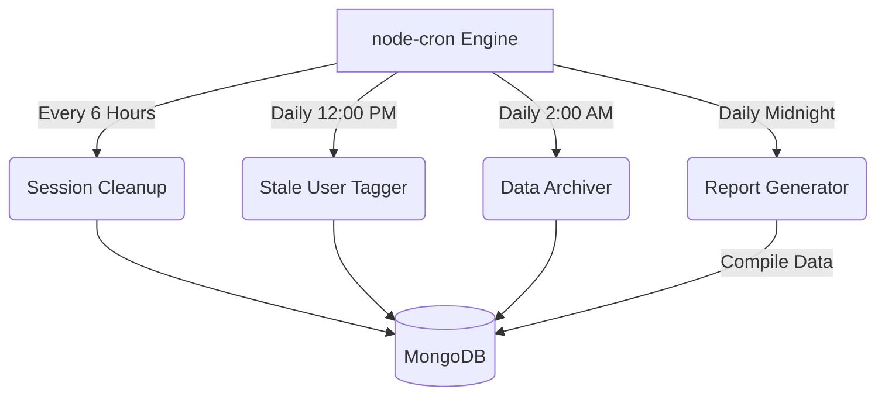

<div align="center">
  <h1>Job Scheduled Tasks Dashboard & API</h1>
  <p><b>An automated backend operations system built to manage database cleanup, session invalidation, log archival, and daily report generation autonomously.</b></p>
  
  
  
  
  
</div>

---

## Overview

This project was built to automate real-world backend maintenance responsibilities. Moving beyond basic REST APIs, it introduces scheduled background jobs that act as the maintenance backbone for the server infrastructure.

By utilizing `node-cron`, the system executes autonomous tasks exactly when required—cleaning up dead sessions, archiving historical logs, tagging inactive users, and generating health reports—all while the main application processes run smoothly. 

---

## Automated Background Tasks (Cron Jobs)

The system revolves around four core scheduled routines. Each handles a critical backend maintenance workflow:

### 1. Stale User Management (`cron/staleusers.cron.js`)
* **Schedule:** Daily at 12:00 PM (`0 12 * * *`)
* **Functionality:** Scans the database for users who have been inactive for an extended period. It automatically performs a "soft delete" or flags them as stale to keep the active user pool optimized.

### 2. Session Cleanup (`cron/deletesession.js`)
* **Schedule:** Every 6 hours (`0 */6 * * *`)
* **Functionality:** Periodically sweeps the database for expired authentication tokens or orphaned sessions. Safely invalidates them, freeing up memory and preventing database bloat.

### 3. Data Log Archival (`cron/archieve.js`)
* **Schedule:** Daily at 2:00 AM (`* 2 * * *`)
* **Functionality:** Validates and moves old system logs from active storage into an archival state, ensuring that the primary database collections remain lightweight and query responses stay fast.

### 4. Daily Report Generation (`cron/generatereport.js`)
* **Schedule:** Daily at Midnight (`0 0 * * *`)
* **Functionality:** Compiles daily system metrics, user statuses, and server health logs into a comprehensive report.

---

## Technology Stack & Architecture

| Technology | Purpose |
| :--- | :--- |
| **Node.js & Express** | Core backend environment and REST API routing |
| **node-cron** | Robust job scheduling to trigger backend logic autonomously |
| **MongoDB & Mongoose** | NoSQL database for structured data management |
| **Axios** | Internal HTTP client used for system health checks and API pinging |
| **EJS** | Server-side templating engine for generating dashboards and views |

### System Flow


---

## Installation & Manual Overrides

Although the engine runs autonomously in the background, administrators can trigger any of the cron operations manually via secure API endpoints.

### Setup Instructions

```bash
# 1. Clone the repository
git clone https://github.com/KOTHAVIVEK55/Scheduled-Tasks-API.git
cd nodecron

# 2. Install dependencies
npm install

# 3. Configure Environment Variables
# Create a .env file and add your MongoDB URL and Server Port
echo "PORT=3000" > .env
echo "db_url=mongodb+srv://<your_mongo_url>" >> .env

# 4. Start the Application
npm start
```

### Manual Trigger REST Endpoints
For administration and testing, you can hit these routes directly to trigger the corresponding background functions instantly:

* `GET /stale` - Force manual scan and cleanup of stale users
* `GET /cleanup` - Force immediate invalid session deletion
* `GET /archieve` - Force manual log archival process
* `GET /report` - Generate a system report immediately
* `GET /health-api` - Check overall system and cron engine health
* `GET /user` - User routing endpoints for general CRUD operations
